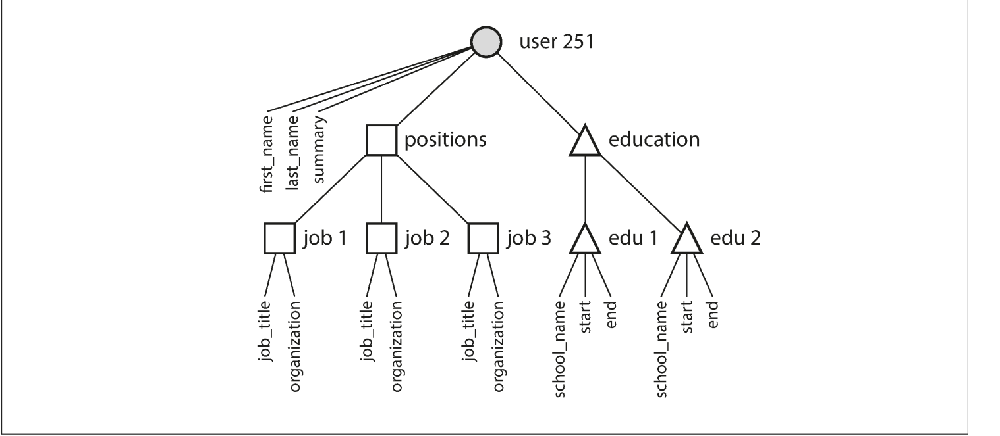

# Locality
Locality = related data stored close together

Better locality ⇒

- Fewer disk seeks / cache misses

- Faster reads

- Simpler access patterns

One To Many Example

## Database Relationship Types (Quick Notes)

### 1. One-to-One (1:1)
- One record in A ↔ one record in B  
- Example: Person – Passport  
- Used when splitting sensitive/optional data.

---

### 2. One-to-Many (1:N)
- One record in A → many records in B  
- Example: Customer – Orders  
- Most common relationship.

---

### 3. Many-to-One (N:1)
- Many records in A → one record in B  
- Example: Orders – Customer  
- Reverse view of 1:N.

---

### 4. Many-to-Many (M:N)
- Many records in A ↔ many records in B  
- Example: Students – Courses  
- Requires a junction (bridge) table (e.g., Enrollment).

---

**Tip:**  
1:N and N:1 are the same relationship, just seen from different sides.

**Network (CODASYL) Model:**  
A database model where records are connected by physical pointers, forming a graph (not just a tree), allowing many-to-many relationships.  
Data was accessed by manually navigating predefined paths, which was fast but made queries complex and inflexible.

## Schema-on-Read vs Schema-on-Write

- **Schema-on-Write (Relational DBs):**  
  Schema is enforced before writing data (like static typing).  
  Format changes usually require migrations (e.g., ALTER TABLE + UPDATE).

- **Schema-on-Read (Document/NoSQL DBs):**  
  Schema is applied when reading data (like dynamic typing).  
  New formats can be written immediately; application handles old data.

---

### When the difference matters most
- During **schema evolution** (e.g., splitting `name` → `first_name`, `last_name`)
- Large migrations can be slow; read-time adaptation avoids rewrites.

---

### Schema-on-Read works best when
- Data is **heterogeneous** (different structures in same collection)
- Many object types or frequently changing formats

