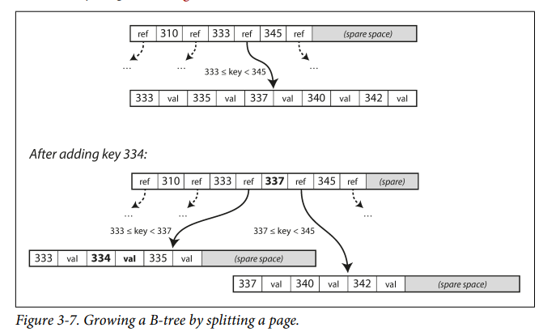

## Transactional vs Analytical Storage Engines

### OLTP (Transactional)
- Many small reads/writes.
- Low latency (ms).
- Touches few rows per query.
- Row-oriented storage.
- Examples: MySQL, PostgreSQL, MongoDB.

### OLAP (Analytical)
- Few but heavy queries.
- Scans millions/billions of rows.
- High throughput.
- Column-oriented storage.
- Examples: BigQuery, Snowflake, Redshift.

---

### Key Difference
- **OLTP** → fast point lookups & updates.  
- **OLAP** → fast large-scale scans & aggregations.

---

**One-liner:**  
Transactional engines run the business; analytical engines analyze the business.


# Hash Indexes (Key–Value Indexing)

## Core Idea
- Maintain an **in-memory hash map**:  
  `key → byte_offset_in_data_file`
- Data is stored in an **append-only log file** on disk.
- On write: append `(key, value)` to file and update hash map.
- On read: use hash map to seek directly to offset and read value.

## Properties
- **Fast reads**: O(1) lookup in memory + one disk seek.
- **Fast writes**: sequential append (disk-friendly).
- Requires **all keys to fit in RAM**.
- Values can exceed RAM (loaded from disk on demand).
- If data is in OS page cache → zero disk I/O.

## Real-World Example
- **Bitcask (Riak)** uses this model.
- Ideal for workloads with:
  - Frequent updates per key.
  - Relatively small number of distinct keys.
  - Example: counters, metrics, URL hit counts.

## Problem: Unbounded Disk Growth
- Append-only logs grow indefinitely.

## Solution: Segmentation
- Split log into **fixed-size segments**.
- Writes go to the **active segment**.
- Old segments become **immutable (frozen)**.

## Compaction
- Process old segments to:
  - Remove obsolete versions of keys.
  - Keep only the **latest value per key**.
- Reduces disk usage.

## Merging
- Multiple compacted segments can be:
  - **Merged into a single new segment**.
- New segment written to a new file.
- Old segments deleted after switch.

## Concurrency Model
- Compaction/merging runs in **background thread**.
- Reads/writes continue using old segments.
- After merge completes → atomically switch to new segment.

## Trade-offs
### Pros
- Simple design.
- Excellent write performance.
- Very low read latency.

### Cons
- Memory bound by number of keys.
- Not suitable for:
  - Very large key spaces.
  - Range queries or ordered scans.

# SSTables and LSM-Trees

## Log-Structured Storage
- Data is stored in **append-only segments** of key-value pairs.
- Newer values **override older values** for the same key.
- Segment order is **write-order**, not sorted.

## SSTable (Sorted String Table)
An **SSTable** is a segment file where:
- Records are **sorted by key**.
- Each key appears **only once per segment** (after compaction).
- Data is still written **sequentially**.

## Compaction (Merging)
- Multiple SSTables are merged using a **merge-sort** algorithm.
- For duplicate keys, **keep value from newest segment**.
- Works efficiently even if files are **larger than memory**.

## Sparse In-Memory Index
- Full index not required.
- Store **one key per few KB**.
- Lookup:
  1. Find nearest key in index.
  2. Seek to offset.
  3. **Sequential scan** to target.

## Block Compression
- Records grouped into **blocks (e.g., 4–16 KB)**.
- Blocks are **compressed on disk**.
- Index points to **block start offsets**.
- Reduces **disk usage and I/O**.
- Eg. trie data structure

## Why Not Binary Search?
- Records are **variable-length**.
- Cannot compute offsets without an index.

## Relation to LSM-Tree
- SSTables are the **on-disk structure** of LSM-Trees.
- Flow: `MemTable → SSTable → Compaction`.
- Used in **LevelDB, RocksDB, Cassandra**.

## Key Idea
> SSTables optimize for **sequential writes + low random I/O**, trading CPU for disk efficiency.


# B-Trees

## Branching Factor
no. of references(pointers) to child pages


# B-Trees — Insert & Update Operations



## Overview

A **B-tree** is a balanced multi-way search tree widely used in databases and file systems for efficient storage and retrieval of sorted key–value data.

### Key Properties

- Data stored in **fixed-size pages** (typically 4 KB).
- Keys inside a node are stored in **sorted order**.
- Internal nodes contain keys and child page references.
- Leaf nodes contain key-value pairs (or pointers to data).
- All leaves are at the same depth.
- Time complexity:
  - Search: `O(log n)`
  - Insert: `O(log n)`
  - Delete: `O(log n)`

---

## Insert Operation

### Steps

1. Start at the root and traverse to the correct **leaf page**.
2. Insert the key in sorted order within the leaf.
3. If the page overflows:
   - Split the page into two half-full pages.
   - Promote the middle key to the parent.
4. If the parent overflows, repeat the split upward.
5. If the root splits, create a new root.

### Result

- Tree always remains balanced.
- Height increases only when the root splits.

---

### Insert Algorithm (Pseudo Code)

```text
INSERT(T, key):

node = FIND_LEAF(T.root, key)
INSERT_IN_ORDER(node, key)

while node is overfull:
    left, right, middle = SPLIT(node)

    if node is root:
        new_root = CREATE_NODE(middle)
        new_root.children = [left, right]
        T.root = new_root
        break
    else:
        INSERT_IN_PARENT(node.parent, middle)
        node = node.parent


```

**B-trees are made reliable by WAL**

```pgsql
Write WAL → Flush → Apply pages → Checkpoint → Delete old WAL

```

```cpp
struct LogRecord {
    LSN                // log sequence number (monotonic)
    TransactionID
    PageID
    PrevLSN            // previous log of same transaction
    Type               // INSERT, UPDATE, DELETE, SPLIT
    RedoInfo           // how to redo change
    UndoInfo           // how to undo change
}

Eg.

Log Record:
LSN = 5001
PageID = 105
Offset = 128
Before = [00 1A]
After  = [00 2B]


```

**LSM-trees are typically faster for writes, whereas B-trees
are thought to be faster for reads**

